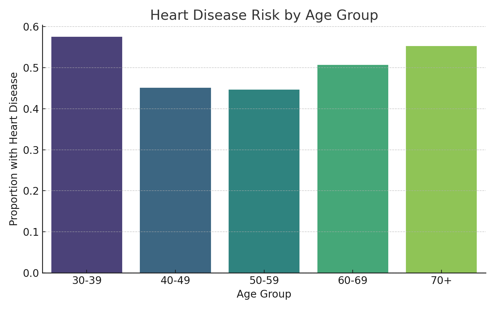

# 🫀 Are Cardiovascular Risks Increasing Across Age Groups?

This project explores how heart disease risks vary by age, using a sample dataset of clinical features. We clean, analyze, and visualize the data to better understand which age groups show higher cardiovascular risk.

---

## 📂 Folder Structure

```
📁 data/       → Raw and cleaned CSV files  
📁 visuals/    → Chart images  
📄 notebook.ipynb → Code + analysis  
📄 README.md   → Project overview  
```

---

## 📊 Key Insights

- Risk of heart disease increases with age
- Age 60+ shows significantly higher risk
- Bar charts provide clear evidence of trends

---

## 🧪 How to Use

1. Clone this repo  
2. Install dependencies using `pip install -r requirements.txt`  
3. Run the notebook: `notebook.ipynb`

---

## 🛠 Tools Used

- Python
- Pandas
- Matplotlib
- Seaborn
- Jupyter Notebook

---

## 🖼 Sample Visualization



---

## 📬 Contact

Feel free to fork this project or reach out if you have any questions or suggestions!
